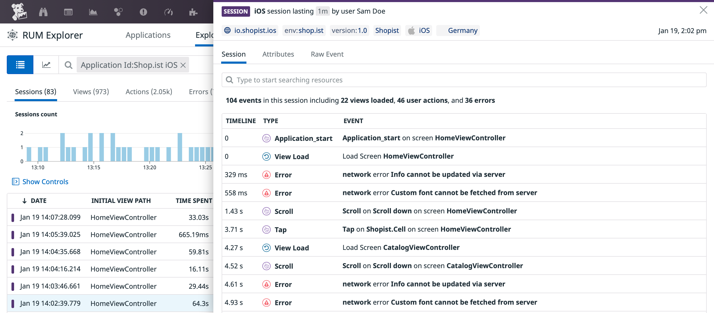

# Datadog SDK for macOS

> Swift and Objective-C libraries to interact with Datadog on macOS.
> In order to compile the sdk for macOS all iOS functionality is wrapped in ```#if os(iOS)```.  The only DD feature availible for macOS is
> Logging, RUM and tracing is not availible. There a small differences in functionality to support macOS, e.g finding the OS name and hostname use 
> OS specific apis.

## Getting Started

### Log Collection

See the dedicated [Datadog iOS Log Collection](https://docs.datadoghq.com/logs/log_collection/ios) documentation to learn how to send logs from your iOS application to Datadog.


### Trace Collection

See [Datadog iOS Trace Collection](https://docs.datadoghq.com/tracing/setup_overview/setup/ios) documentation to try it out.


### RUM Events Collection

See [Datadog iOS RUM Collection](https://docs.datadoghq.com/real_user_monitoring/ios) documentation to try it out.



## Integrations

### Alamofire

If you use [Alamofire](https://github.com/Alamofire/Alamofire), review the [`DatadogAlamofireExtension` library](Sources/DatadogExtensions/Alamofire/) to learn how to automatically instrument requests with the Datadog iOS SDK.

## Contributing

Pull requests are welcome. First, open an issue to discuss what you would like to change. For more information, read the [Contributing Guide](CONTRIBUTING.md).

## License

[Apache License, v2.0](LICENSE)
